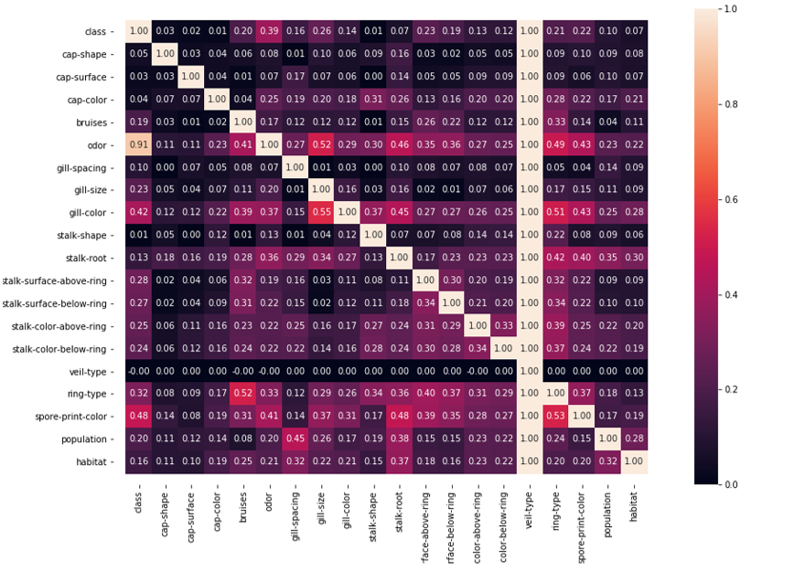
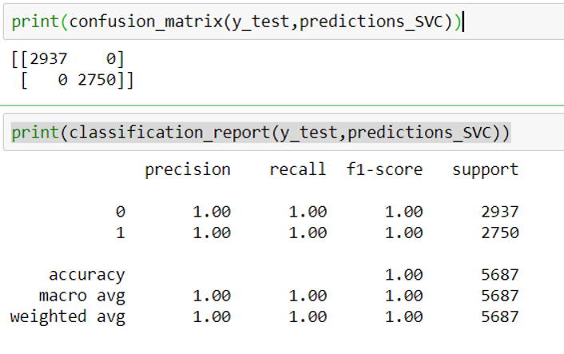
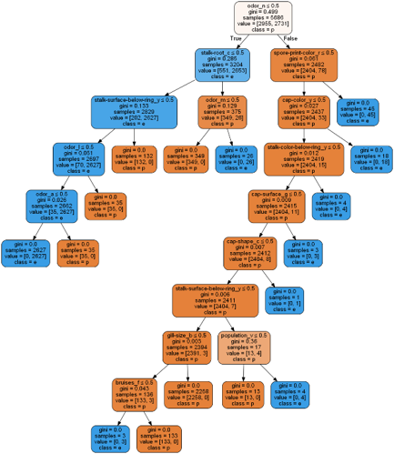
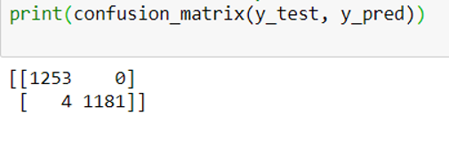
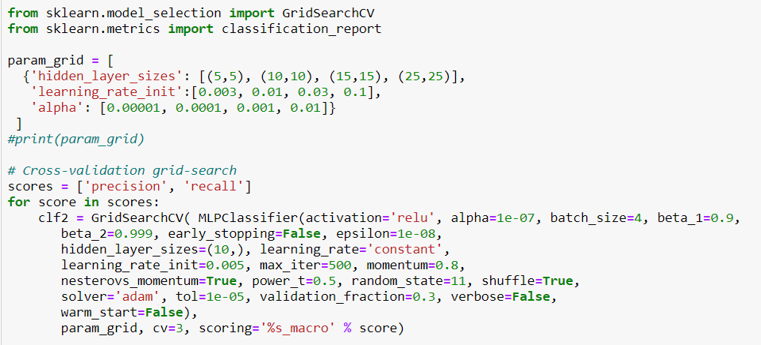
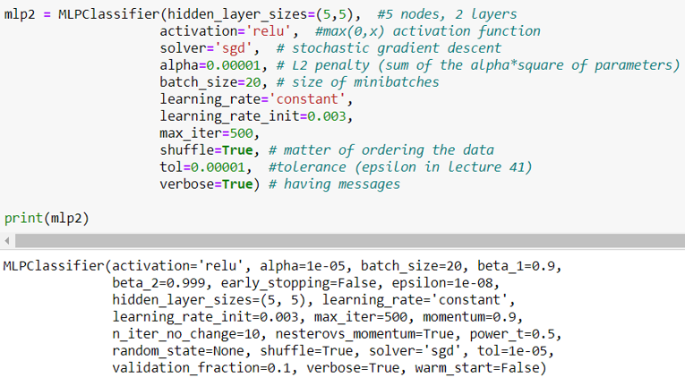
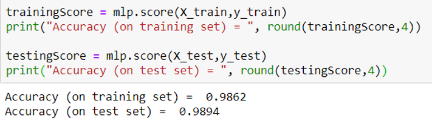

# Mushroom Recommender #

This project aims to study about machine learning models considering real observations. It consists of data preprocessing, feature elimination, model selection and interpretation of results. Data contains certain type of mushrooms with their physical descriptions. The main goal is to find or build a model which is able to identify the edible mushrooms from the poisonous ones regarding their features.

[Kaggle link for the dataset](https://www.kaggle.com/uciml/mushroom-classification)

## Data Preprocessing ##

Uncertainty coefficients are calculated for given features.

## Data Preprocessing ##

### Model Selection ###

- ***Linear support vector classifier***  
 After applying K- fold cross validation for K=10, it gives 1 accuracy score.

- ***Decision tree classifier***  

- ***Multi layer perceptron classifier***  

The accuracy score of a simple model with 1 neuron in he first layer and 2 neurons in the second is very weak. Grid search providing the best parameters (2 layers with 5 neurons) helped to improve the result.

